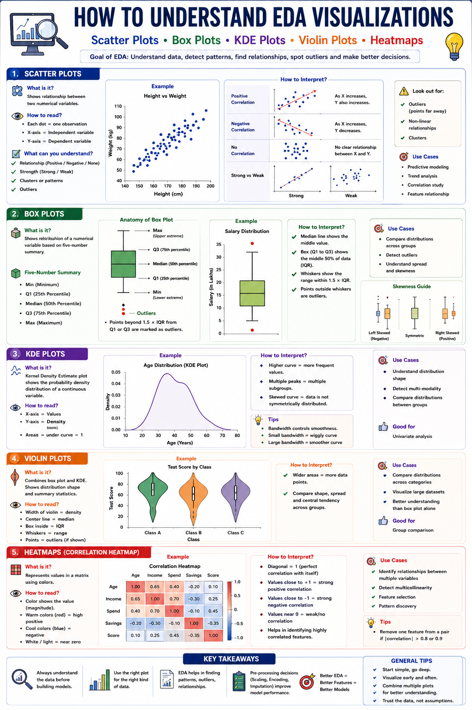

# 📊 Exploratory Data Analysis (EDA)

> **Exploratory Data Analysis (EDA)** is the process of understanding a dataset before building Machine Learning models. It helps uncover patterns, identify relationships, detect outliers, understand feature distributions, and make informed preprocessing decisions.

## 🎯 Learning Objectives

- Understand the structure of a dataset.
- Analyze categorical and numerical features.
- Detect patterns and relationships.
- Identify outliers.
- Measure feature correlations.
- Build intuition before model training.

---

# EDA Workflow

```text
Load Dataset
      │
      ▼
Data Overview
      │
      ▼
Missing Value Analysis
      │
      ▼
Categorical Analysis
      │
      ▼
Distribution Analysis
      │
      ▼
Relationship Analysis
      │
      ▼
Correlation Analysis
      │
      ▼
Outlier Detection
      │
      ▼
Key Insights
```

---

# 🖼️ EDA Visualization Cheat Sheet

Place your uploaded infographic in the repository under:

```text
images/eda_visualizations.png
```

Then display it using:

```markdown

```


---

# 📚 Visualization Guide

## 1. Scatter Plot
**Purpose:** Understand relationships between two numerical variables.

**Use Cases**
- Relationship analysis
- Trend analysis
- Cluster detection
- Outlier detection

**Interpretation**
- Upward trend → Positive correlation
- Downward trend → Negative correlation
- Random pattern → No correlation

---

## 2. Box Plot
**Purpose:** Summarize a numerical feature using the Five-Number Summary.

Shows:
- Minimum
- Q1
- Median
- Q3
- Maximum
- Outliers

---

## 3. KDE Plot
**Purpose:** Understand the probability density of a continuous variable.

Look for:
- Peaks
- Skewness
- Multiple modes

---

## 4. Violin Plot
**Purpose:** Combine Box Plot and KDE Plot.

Useful for comparing distributions across categories.

---

## 5. Correlation Heatmap

| Correlation | Meaning |
|---|---|
| +1 | Perfect Positive |
| 0 | No Relationship |
| -1 | Perfect Negative |

Useful for:
- Feature Selection
- Multicollinearity Detection

---

# 🔍 Questions to Ask During EDA

- Are there missing values?
- Are there outliers?
- Which features are highly correlated?
- Which features best separate the target classes?
- Is the data normally distributed?

---

# 💡 Key Takeaways

- Perform EDA before feature engineering and model building.
- Choose the correct visualization for each data type.
- Use multiple visualizations to validate insights.
- EDA improves preprocessing and model performance.

Happy Learning! 🚀
